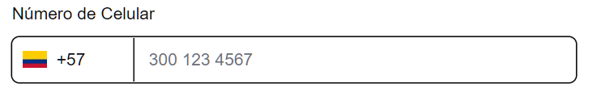
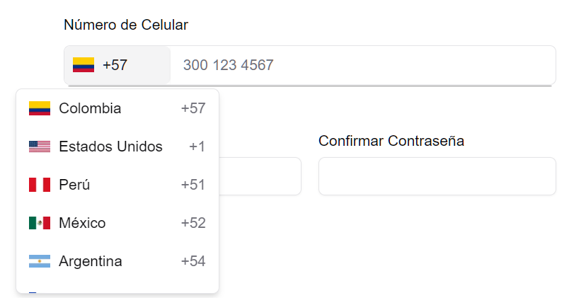

# 📞 react-phone-input-prefixes
## 📸 Demo




## ✨ Features

- Country selector with flags.
- Flag images obtained from `flagcdn.com`.
- Fully styled with **TailwindCSS** and built with **Radix UI** (no shadcn/ui dependency).
- Add new countries easily.
- Highly reusable and customizable.
- Ideal for international forms and localization.

Español:

- Selector de países con sus banderas.
- Imágenes de banderas obtenidas de `flagcdn.com`.
- Totalmente estilizado con **TailwindCSS** y construido con **Radix UI** (sin dependencia de shadcn/ui).
- Agrega nuevos países fácilmente.
- Altamente reutilizable y personalizable.
- Ideal para formularios internacionales y localización.

---

## 🚀 Installation

```bash
npm install react-phone-input-prefixes @radix-ui/react-popover @radix-ui/react-scroll-area
# o
yarn add react-phone-input-prefixes @radix-ui/react-popover @radix-ui/react-scroll-area
```

**Peer dependencies:**
- `react` >= 18
- `tailwindcss` >= 3.0.0

---

## ⚙️ Configuration

En Next.js, permite las imágenes desde `flagcdn.com` en `next.config.js`:

```ts
const nextConfig = {
  images: {
    remotePatterns: [
      {
        protocol: 'https',
        hostname: 'flagcdn.com',
      },
    ],
  },
};

export default nextConfig;
```

---

## 📦 Basic usage

```tsx
import React from "react";
import PhoneInputWithPrefixes from "react-phone-input-prefixes";

export default function App() {
  return (
    <div className="p-4">
      <PhoneInputWithPrefixes
        value=""
        onChange={(value, code) => console.log(value, code)}
        countryDefault="co"
      />
    </div>
  );
}
```

---

## 🎨 Customization

```tsx
<PhoneInputWithPrefixes
  enableSearch
  countryDefault="co"
  countries={[
    { iso: "co", code: "+57", name: "Colombia" },
    { iso: "us", code: "+1", name: "Estados Unidos" },
    { iso: "mx", code: "+52", name: "México" },
    { iso: "pe", code: "+51", name: "Perú" }
  ]}
  placeholder="Ingresa tu número"
  inputProps={{
    name: 'phone',
    required: true,
    autoFocus: true
  }}
  inputStyle={{ width: '100%' }}
  containerStyle={{ border: '1px solid #ccc', borderRadius: '6px' }}
/>
```

---

## 📦 Props

| Prop             | Tipo                                              | Descripción                                                    |
|------------------|---------------------------------------------------|----------------------------------------------------------------|
| `value`          | `string`                                          | El número sin código de país.                                  |
| `onChange`       | `(value: string, code: string) => void`           | Callback al cambiar el número o el país.                       |
| `countries`      | `{ iso: string; code: string; name: string; }[]`  | Lista de países adicionales.                                   |
| `onlyCountries`  | `string[]`                                        | Lista de códigos ISO que limita qué países mostrar.            |
| `countryDefault` | `string`                                          | ISO del país seleccionado por defecto.                         |
| `label`          | `string`                                          | Texto del label (por defecto: "Phone number").                 |
| `placeholder`    | `string`                                          | Placeholder del input.                                         |
| `inputStyle`     | `React.CSSProperties`                             | Estilos inline para el `<input />`.                            |
| `containerStyle` | `React.CSSProperties`                             | Estilos inline para el contenedor completo del componente.     |
| `enableSearch`   | `boolean`                                         | Si permite buscar en la lista de países.                       |
| `inputProps`     | `React.InputHTMLAttributes<HTMLInputElement>`     | Props extra para el input.                                     |

---

## 🌐 Default countries

Por defecto incluye:

- 🇨🇴 Colombia (+57)
- 🇺🇸 Estados Unidos (+1)
- 🇵🇪 Perú (+51)
- 🇲🇽 México (+52)
- 🇦🇷 Argentina (+54)
- 🇨🇱 Chile (+56)

...y más.

---

## 📄 License

MIT License

Copyright (c) 2025 César Navarro.